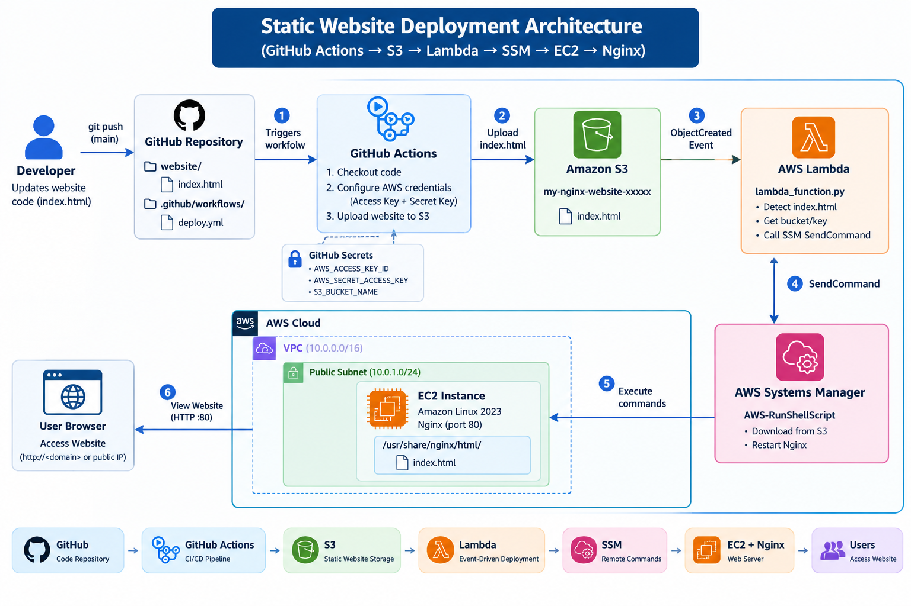

# 🚀 Event-Driven Website Auto-Deployment

This project implements an **event-driven automated website deployment system** using **AWS S3, Lambda, AWS Systems Manager (SSM), EC2, Nginx, IAM, and GitHub**.

Whenever `index.html` is uploaded or updated in the S3 bucket, an **S3 ObjectCreated event automatically triggers Lambda**.

Lambda then uses **AWS Systems Manager Run Command** to execute commands on the EC2 instance. The EC2 instance downloads the latest `index.html` from S3 and copies it to the Nginx web directory.


This eliminates manual deployment and provides a simple **event-driven CI/CD-style deployment workflow**.

---

# 🏗️ Architecture




---

# 📌 Project Objective

The objective is to automatically deploy changes made to `index.html`.

## Without Automation

```text
Developer
   ↓
Upload index.html
   ↓
Login to EC2
   ↓
Download file
   ↓
Copy file
   ↓
Restart/Reload Nginx
```

## With Automation

```text
Developer
   ↓
GitHub / Upload
   ↓
S3
   ↓
S3 Event
   ↓
Lambda
   ↓
SSM
   ↓
EC2
   ↓
Nginx
   ↓
Website Updated Automatically
```

---

# 🛠️ AWS Services Used

| Service             | Purpose                    |
| ------------------- | -------------------------- |
| Amazon S3           | Stores website files       |
| AWS Lambda          | Processes S3 events        |
| Amazon EC2          | Hosts website              |
| AWS Systems Manager | Executes commands on EC2   |
| IAM                 | Provides AWS permissions   |
| Nginx               | Web server                 |
| CloudWatch          | Monitoring and Lambda logs |
| GitHub              | Source-code repository     |

---

# 📁 Project Structure

```text
s3-lambda-ec2-nginx/
│
├── README.md
│
├── index.html
│
└── images/
    └── architecture.png
```

---

# 🔧 Prerequisites

Before starting, make sure you have:

* AWS Account
* AWS CLI
* GitHub Account
* GitHub Repository
* EC2 instance
* Nginx installed on EC2
* S3 bucket
* IAM permissions
* SSM Agent installed/running
* Python Lambda runtime

---

# 1️⃣ Create S3 Bucket

Create an S3 bucket.

Example:

```text
my-nginx-website
```

Upload:

```text
index.html
```

The object will be:

```text
s3://my-nginx-website/index.html
```

---

# 2️⃣ Configure EC2

Launch an EC2 instance.

For Ubuntu:

```bash
sudo apt update
sudo apt install nginx -y
```

For Amazon Linux:

```bash
sudo yum update -y
sudo yum install nginx -y
```

Start Nginx:

```bash
sudo systemctl start nginx
```

Enable Nginx:

```bash
sudo systemctl enable nginx
```

Check status:

```bash
sudo systemctl status nginx
```

Expected:

```text
Active: active (running)
```

---

# 3️⃣ Configure Nginx

The website directory should be:

```text
/usr/share/nginx/html/
```

Check:

```bash
ls -la /usr/share/nginx/html/
```

Test:

```bash
curl http://localhost
```

---

# 4️⃣ Install and Configure SSM Agent

Check SSM Agent:

```bash
sudo systemctl status amazon-ssm-agent
```

For Ubuntu systems using Snap:

```bash
sudo snap install amazon-ssm-agent --classic
```

Enable:

```bash
sudo systemctl enable snap.amazon-ssm-agent.amazon-ssm-agent.service
```

Start:

```bash
sudo systemctl start snap.amazon-ssm-agent.amazon-ssm-agent.service
```

Check:

```bash
sudo systemctl status snap.amazon-ssm-agent.amazon-ssm-agent.service
```

Expected:

```text
Active: active (running)
```

---

# 5️⃣ EC2 IAM Role

Create an IAM role for EC2.

Attach the AWS managed policy:

```text
AmazonSSMManagedInstanceCore
```

This allows EC2 to communicate with AWS Systems Manager.

The flow is:

```text
EC2
 ↓
SSM Agent
 ↓
AWS Systems Manager
```

---

# 6️⃣ EC2 S3 Read Permission

The EC2 instance needs permission to download the website from S3.

Attach this inline policy to the **EC2 IAM role**:

```json
{
    "Version": "2012-10-17",
    "Statement": [
        {
            "Sid": "ReadWebsiteFile",
            "Effect": "Allow",
            "Action": [
                "s3:GetObject"
            ],
            "Resource": "arn:aws:s3:::my-nginx-website/index.html"
        }
    ]
}
```

This allows:

```bash
aws s3 cp s3://my-nginx-website/index.html /tmp/index.html
```

but does not give the EC2 instance permission to modify the S3 object.

---

# 7️⃣ Test S3 Access From EC2

Run:

```bash
aws s3 cp s3://my-nginx-website/index.html /tmp/index.html
```

Check:

```bash
cat /tmp/index.html
```

If successful:

```text
S3 → EC2
```

is working.

---

# 8️⃣ Create Lambda IAM Role

Create:

```text
lambda-s3-to-ec2-role
```

Trusted entity:

```text
AWS Service
```

Use case:

```text
Lambda
```

Attach:

```text
AWSLambdaBasicExecutionRole
```

This provides CloudWatch Logs permissions.

---

# 9️⃣ Lambda SSM Permission

Add an inline policy to the Lambda role:

```json
{
    "Version": "2012-10-17",
    "Statement": [
        {
            "Sid": "SendCommandToEC2",
            "Effect": "Allow",
            "Action": [
                "ssm:SendCommand"
            ],
            "Resource": "*"
        }
    ]
}
```

For monitoring command execution, you can also add:

```json
"ssm:GetCommandInvocation"
```

Example:

```json
{
    "Version": "2012-10-17",
    "Statement": [
        {
            "Sid": "SSMCommands",
            "Effect": "Allow",
            "Action": [
                "ssm:SendCommand",
                "ssm:GetCommandInvocation"
            ],
            "Resource": "*"
        }
    ]
}
```

---

# 🔟 IAM Permission Summary

There are **two important IAM roles** in this architecture.

## EC2 IAM Role

```text
EC2 IAM Role
│
├── AmazonSSMManagedInstanceCore
│
└── s3:GetObject
       │
       └── my-nginx-website/index.html
```

Purpose:

```text
EC2 → S3
EC2 → SSM
```

---

## Lambda IAM Role

```text
Lambda IAM Role
│
├── AWSLambdaBasicExecutionRole
│
└── ssm:SendCommand
```

Purpose:

```text
Lambda → SSM → EC2
```

---

# 1️⃣1️⃣ Create Lambda Function

Go to:

```text
AWS Console
→ Lambda
→ Create Function
```

Select:

```text
Author from scratch
```

Function name:

```text
s3-index-html-update
```

Runtime:

```text
Python 3.x
```

Select:

```text
Use an existing role
```

Choose:

```text
lambda-s3-to-ec2-role
```

---

# 1️⃣2️⃣ Lambda Function Code

Use:

```python
import boto3

ssm = boto3.client("ssm", region_name="us-east-1")

INSTANCE_ID = "i-xxxxxxxxxxxxxxxxx"
BUCKET = "my-nginx-website"
KEY = "index.html"


def lambda_handler(event, context):

    commands = [
        f"aws s3 cp s3://{BUCKET}/{KEY} /tmp/index.html",
        "sudo cp /tmp/index.html /usr/share/nginx/html/index.html"
    ]

    response = ssm.send_command(
        InstanceIds=[INSTANCE_ID],
        DocumentName="AWS-RunShellScript",
        Parameters={
            "commands": commands
        }
    )

    command_id = response["Command"]["CommandId"]

    print("SSM Command ID:", command_id)

    return {
        "statusCode": 200,
        "message": "Website deployment started",
        "command_id": command_id
    }
```

### Important

Change:

```python
INSTANCE_ID = "i-xxxxxxxxxxxxxxxxx"
```

to your real EC2 instance ID.

Example:

```python
INSTANCE_ID = "i-0123456789abcdef0"
```

Do not use an AMI ID.

❌ Wrong:

```text
ami-0123456789abcdef0
```

✅ Correct:

```text
i-0123456789abcdef0
```

---

# 1️⃣3️⃣ Test Lambda

Click:

```text
Deploy
```

Then:

```text
Test
```

Create test event:

```json
{
    "test": "hello"
}
```

Run the test.

Expected response:

```json
{
    "statusCode": 200,
    "message": "Website deployment started",
    "command_id": "xxxxxxxx-xxxx-xxxx-xxxx-xxxxxxxxxxxx"
}
```

---

# 1️⃣4️⃣ Verify SSM Command

Use:

```bash
aws ssm get-command-invocation \
    --command-id "COMMAND_ID" \
    --instance-id "INSTANCE_ID"
```

Check:

```text
Status
```

Expected:

```text
Success
```

---

# 1️⃣5️⃣ Verify Website on EC2

Check the file:

```bash
cat /usr/share/nginx/html/index.html
```

Test Nginx:

```bash
curl http://localhost
```

---

# 1️⃣6️⃣ Configure S3 → Lambda Trigger

Go to:

```text
AWS Console
→ Lambda
→ s3-index-html-update
→ Add Trigger
```

Select:

```text
Source:
S3
```

Bucket:

```text
my-nginx-website
```

Event:

```text
All object create events
```

Use a suffix filter:

```text
.html
```

For this project, the expected object is:

```text
index.html
```

Now the flow becomes:

```text
S3 ObjectCreated
       ↓
Lambda
       ↓
SSM
       ↓
EC2
       ↓
Nginx
```

---

# 1️⃣7️⃣ GitHub Integration

GitHub can be used as the **source-code repository** for the website.

Example repository:

```text
s3-lambda-ec2-nginx
```

Repository:

```text
README.md
index.html
images/
```

Developer workflow:

```text
Developer
    ↓
GitHub
    ↓
index.html
    ↓
S3
    ↓
Lambda
    ↓
SSM
    ↓
EC2
    ↓
Nginx
```

---

# 🔐 GitHub Repository Permissions

GitHub repository permissions are **separate from AWS IAM**.

For a GitHub repository, typical access levels are:

```text
Read
Triage
Write
Maintain
Admin
```

## Read Access

If someone only needs to view/clone the project:

```text
Repository
→ Settings
→ Collaborators
→ Add people
→ Select Read
```

Read access allows users to:

* View the repository
* Clone the repository
* Download files
* Read README
* Review source code

It does not normally allow them to push changes.

---

# ✏️ GitHub Write Access

If a developer needs to modify:

```text
index.html
README.md
```

and push changes:

```text
Repository
→ Settings
→ Collaborators
→ Add people
→ Write
```

Write access allows the user to contribute changes to the repository.

---

# 🔑 GitHub Actions AWS Permissions

If GitHub Actions will later upload `index.html` to S3 automatically, do **not** store an AWS access key directly inside the repository.

Recommended architecture:

```text
GitHub
   ↓
GitHub Actions
   ↓
AWS IAM / OIDC
   ↓
S3
   ↓
Lambda
   ↓
SSM
   ↓
EC2
```

Use **GitHub Actions OIDC** to authenticate GitHub with AWS without storing long-lived AWS access keys.

The GitHub Actions IAM role can have a restricted policy such as:

```json
{
    "Version": "2012-10-17",
    "Statement": [
        {
            "Sid": "UploadWebsite",
            "Effect": "Allow",
            "Action": [
                "s3:PutObject"
            ],
            "Resource": "arn:aws:s3:::my-nginx-website/index.html"
        }
    ]
}
```

Then GitHub Actions can upload:

```bash
aws s3 cp index.html s3://my-nginx-website/index.html
```

This automatically triggers:

```text
GitHub
   ↓
GitHub Actions
   ↓
S3
   ↓
S3 Event
   ↓
Lambda
   ↓
SSM
   ↓
EC2
   ↓
Nginx
```

---

# 1️⃣8️⃣ GitHub Actions Example

Create:

```text
.github/workflows/deploy.yml
```

Example:

```yaml
name: Deploy Website

on:
  push:
    branches:
      - main

permissions:
  id-token: write
  contents: read

jobs:
  deploy:
    runs-on: ubuntu-latest

    steps:

      - name: Checkout Repository
        uses: actions/checkout@v4

      - name: Configure AWS Credentials
        uses: aws-actions/configure-aws-credentials@v4
        with:
          role-to-assume: ${{ secrets.AWS_ROLE_ARN }}
          aws-region: us-east-1

      - name: Upload Website
        run: |
          aws s3 cp index.html s3://my-nginx-website/index.html

      - name: Deployment Complete
        run: |
          echo "Website uploaded to S3"
          echo "S3 Event will trigger Lambda automatically"
```

The important GitHub permission is:

```yaml
permissions:
  id-token: write
  contents: read
```

`contents: read` allows GitHub Actions to read the repository.

`id-token: write` allows GitHub Actions to request an OIDC token for AWS authentication.

---

# 1️⃣9️⃣ Test Automatic Deployment

Modify:

```text
index.html
```

Commit:

```bash
git add index.html
git commit -m "Update website"
git push origin main
```

GitHub Actions uploads the file:

```text
GitHub
   ↓
GitHub Actions
   ↓
S3
```

S3 generates:

```text
ObjectCreated
```

Lambda is triggered:

```text
S3
 ↓
Lambda
```

Lambda sends:

```text
SSM SendCommand
```

SSM executes on EC2:

```bash
aws s3 cp s3://my-nginx-website/index.html /tmp/index.html
```

Then:

```bash
sudo cp /tmp/index.html /usr/share/nginx/html/index.html
```

Finally:

```text
EC2
 ↓
Nginx
 ↓
Live Website
```

---

# 📊 Complete Deployment Flow

```text
┌───────────────┐
│   Developer   │
└───────┬───────┘
        │
        │ git push
        ▼
┌───────────────┐
│    GitHub     │
└───────┬───────┘
        │
        │ GitHub Actions
        ▼
┌───────────────┐
│      S3       │
│  index.html   │
└───────┬───────┘
        │
        │ ObjectCreated
        ▼
┌───────────────┐
│    Lambda     │
└───────┬───────┘
        │
        │ SendCommand
        ▼
┌───────────────┐
│      SSM      │
└───────┬───────┘
        │
        │ RunShellScript
        ▼
┌───────────────┐
│      EC2      │
│  SSM Agent    │
└───────┬───────┘
        │
        │ Copy index.html
        ▼
┌─────────────────────────┐
│ /usr/share/nginx/html/  │
│       index.html        │
└───────────┬─────────────┘
            │
            ▼
      ┌───────────┐
      │   Nginx   │
      └─────┬─────┘
            │
            ▼
       🌐 Website
```

---

# 🔐 IAM Architecture

```text
                    AWS IAM
                       │
          ┌────────────┼─────────────┐
          │            │             │
          ▼            ▼             ▼
       GitHub         Lambda        EC2
       Role            Role          Role
          │            │             │
          │            │             ├── SSM
          │            │             │
          │            │             └── S3 GetObject
          │            │
          │            └── SSM SendCommand
          │
          └── S3 PutObject
```

### GitHub Role

```text
s3:PutObject
```

### Lambda Role

```text
ssm:SendCommand
ssm:GetCommandInvocation
CloudWatch Logs
```

### EC2 Role

```text
AmazonSSMManagedInstanceCore
s3:GetObject
```

---

# 🔍 Monitoring

Lambda logs:

```text
AWS Console
→ CloudWatch
→ Log groups
→ /aws/lambda/s3-index-html-update
```

Check SSM commands:

```bash
aws ssm list-command-invocations \
    --details \
    --output table
```

Check EC2:

```bash
sudo systemctl status nginx
```

Check website:

```bash
curl http://localhost
```

---

# 🔐 Security Improvements

For production:

* Use IAM least privilege
* Restrict S3 `GetObject` to the required object
* Restrict GitHub Actions to `s3:PutObject`
* Use GitHub OIDC instead of AWS access keys
* Enable S3 Block Public Access
* Enable S3 versioning
* Enable CloudTrail
* Monitor Lambda errors
* Use HTTPS
* Use Route 53 custom domain
* Use CloudFront for public websites
* Consider rollback using S3 object versions
* Avoid `Resource: "*"` where resource-level restrictions are supported

---

# 🎯 Final Result

The project provides an automated deployment pipeline:

```text
GitHub
   ↓
GitHub Actions
   ↓
S3
   ↓
S3 Event
   ↓
Lambda
   ↓
AWS SSM
   ↓
EC2
   ↓
Nginx
   ↓
🌐 Live Website
```

A developer only needs to:

```bash
git add .
git commit -m "Update website"
git push origin main
```

The website deployment then happens automatically.

---

# 🏆 Technologies

```text
GitHub
GitHub Actions
AWS S3
AWS Lambda
AWS EC2
AWS IAM
AWS Systems Manager
AWS CloudWatch
Nginx
Python
HTML
CSS
```
